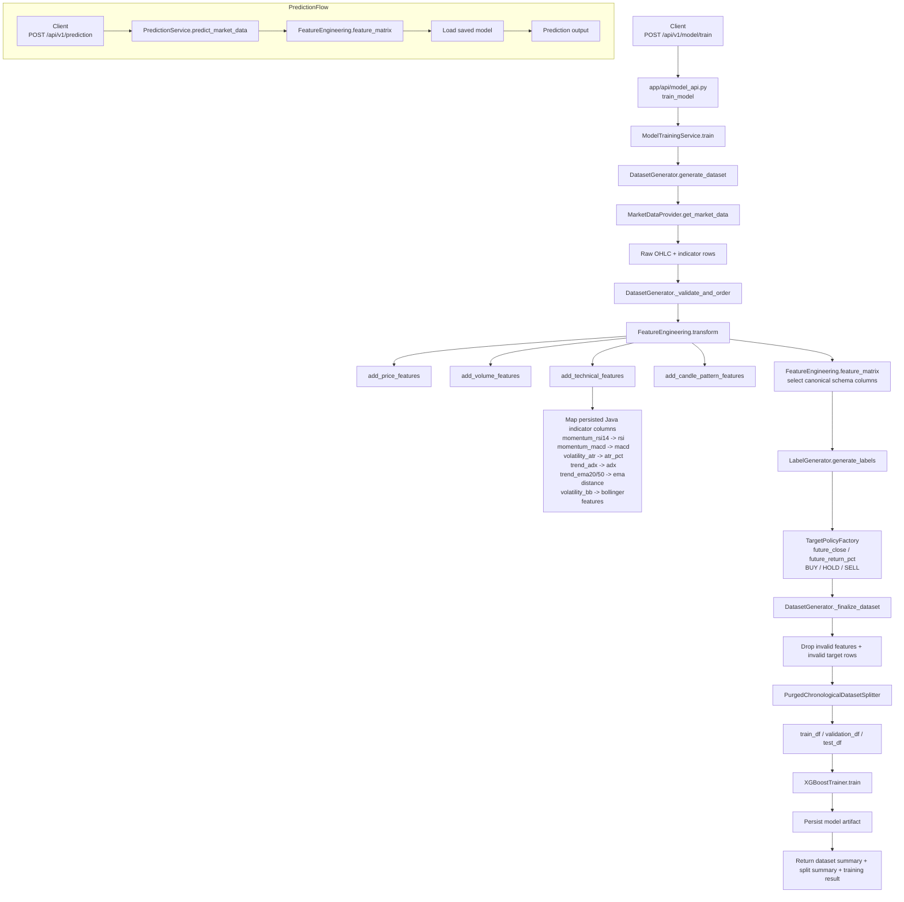

# Trade ML Service Flow Diagram

## Runtime flow summary
- Request comes in through [app/api/model_api.py](app/api/model_api.py).
- Training orchestration lives in [app/training/model_training_service.py](app/training/model_training_service.py).
- Dataset assembly happens in [app/dataset/dataset_generator.py](app/dataset/dataset_generator.py).
- Feature engineering happens in [app/features/feature_engineering.py](app/features/feature_engineering.py).
- Indicator conversion happens in [app/features/technical_features.py](app/features/technical_features.py).
- The canonical training schema is defined in [app/features/feature_schema.py](app/features/feature_schema.py).
